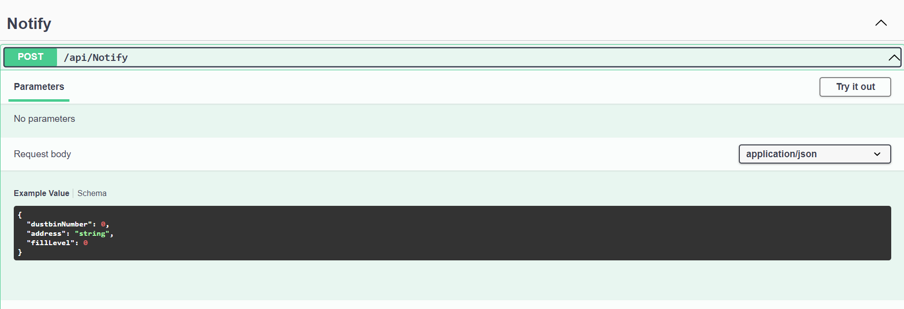

# Dustbin_Detection_System

# Getting Started

* Clone the repository
* Open with Visual Studio
* Run your application by clicking play button

# Use this demo

* run api by trying out
* provide dustbin number and details

# What it does?

* Api takes the dustbin number,address and fill level
* It check address lies within which area by using coordinate service which detects latitude and longitude from an address
* And then it notify the area inspector by sending an email if dustbin fill level is greater than 80% 